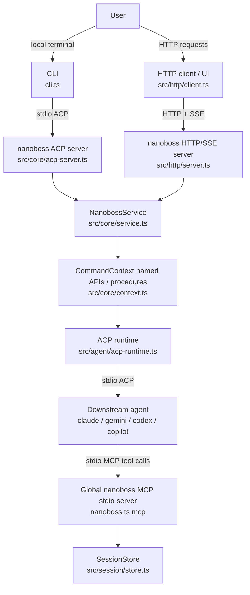
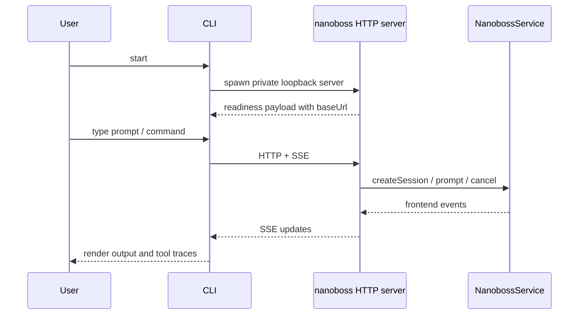
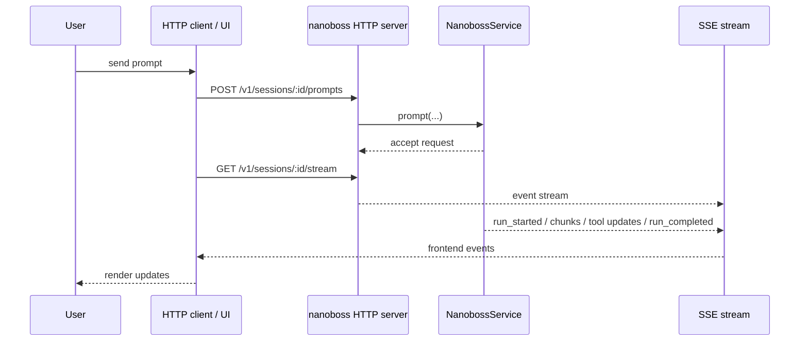
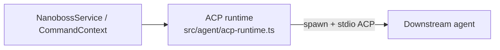
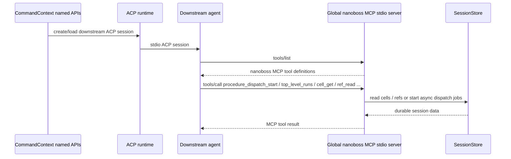

# nanoboss architecture

This document describes the transport-level architecture of nanoboss.

The key distinction is:

- **frontend transport**: how a user or UI talks to nanoboss
- **agent transport**: how nanoboss talks to downstream agents
- **session inspection transport**: how downstream agents inspect nanoboss session state

## Transport inventory

### 1. Frontend HTTP/SSE
Used when nanoboss runs as an HTTP server.

- request/response API:
  - `POST /v1/sessions`
  - `POST /v1/sessions/:id/prompts`
  - `POST /v1/sessions/:id/cancel`
  - `GET /v1/sessions/:id`
- streaming API:
  - `GET /v1/sessions/:id/stream` via **SSE**

Relevant files:
- `src/http/server.ts`
- `src/http/client.ts`
- `src/http/frontend-events.ts`
- `src/core/service.ts`

### 2. ACP over stdio
Used in two places:

- the local CLI launches nanoboss's internal ACP server over stdio
- nanoboss launches downstream agents over stdio ACP

Relevant files:
- nanoboss ACP server:
  - `src/core/acp-server.ts`
  - `cli.ts`
- downstream ACP client/runtime:
  - `src/agent/acp-runtime.ts`
  - `src/agent/call-agent.ts`
  - `src/agent/default-session.ts`

### 3. Global nanoboss MCP over stdio
Used so downstream agents can inspect durable nanoboss session cells and refs and dispatch slash commands through one shared MCP surface.

This is **not** ACP. It is a globally registered MCP server surfaced as `nanoboss` over stdio.

Relevant files:
- `nanoboss.ts`
- `src/mcp/registration.ts`
- `src/mcp/server.ts`
- `src/session/store.ts`

---

## High-level picture

---

## Default CLI path

When you run `nanoboss cli` without `--server-url`, the CLI first starts an
owned private loopback HTTP/SSE server on an ephemeral port and then connects to
that exact server. If you pass `--server-url`, the CLI switches to explicit
connect-only mode and validates the target server without killing or restarting
it.

Relevant files:
- `cli.ts`
- `src/core/acp-server.ts`
- `src/core/service.ts`

---

## HTTP/SSE frontend path

When you run `nanoboss http`, frontend clients talk to nanoboss over HTTP, and live updates come back over SSE.

Relevant files:
- `src/http/server.ts`
- `src/http/client.ts`
- `src/http/frontend-events.ts`
- `src/core/service.ts`

---

## Downstream agent path

Nanoboss talks to downstream agents using **ACP over stdio**.

This path is used by:
- one-shot `ctx.agent.run(...)` with the default `session: "fresh"` mode
- `ctx.agent.run(..., { session: "default" })` and `/default` for persistent conversation reuse

Both session modes share the same prompt-building, named-ref injection, and typed JSON parse/retry machinery. The difference is only the transport:

- **fresh**: starts a new ACP session for an isolated downstream call
- **default**: reuses the session-wide default ACP conversation when continuity is desired

For procedure authors, the namespace split is:

- `ctx.state`: durable stored cells, structural traversal, and refs
- `ctx.session`: live default-agent control and token usage for the current binding

Relevant files:
- `src/agent/acp-runtime.ts`
- `src/agent/call-agent.ts`
- `src/agent/default-session.ts`
- `src/core/context.ts`

---

## Global nanoboss MCP path

Nanoboss standardizes on one **globally registered stdio MCP server** named `nanoboss` so every downstream agent can inspect stored session state and dispatch slash commands through the same surfaced tool path.

This is the current shape:

- downstream agent connection to nanoboss: **ACP over stdio**
- downstream agent connection to nanoboss MCP: **MCP over stdio**
- session targeting: **explicit in the tool arguments and prompt protocol**

Relevant files:
- `nanoboss.ts`
- `src/mcp/registration.ts`
- `src/mcp/server.ts`
- `src/session/store.ts`

---

## What is *not* split today

### ACP is not HTTP + stdio in this repo
ACP is currently **stdio-only** in nanoboss.

- nanoboss ACP server: stdio only
- downstream agent ACP runtime: stdio only

There is no parallel HTTP ACP implementation in nanoboss.

### Nanoboss MCP is not stdio + HTTP
The global `nanoboss` MCP server is currently **stdio-only**.

There is no parallel HTTP MCP implementation in nanoboss.

---

## Transport matrix

| Layer | Protocol | Transport | Direction |
|---|---|---|---|
| Local CLI ↔ nanoboss | ACP | stdio | bidirectional |
| HTTP client ↔ nanoboss | nanoboss frontend API | HTTP | request/response |
| HTTP client ↔ nanoboss | frontend events | SSE | server → client |
| nanoboss ↔ downstream agent | ACP | stdio | bidirectional |
| downstream agent ↔ global nanoboss MCP | MCP | stdio | bidirectional |

---

## Mental model

A useful way to think about the stack is:

1. **Users talk to nanoboss** either through:
   - local CLI over **ACP/stdin-stdout**, or
   - remote HTTP API over **HTTP + SSE**
2. **Nanoboss talks to downstream agents** over **ACP/stdin-stdout**
3. **Downstream agents inspect nanoboss session state and dispatch slash commands** through the globally registered **`nanoboss` MCP over stdio**

So the current architecture is intentionally mixed:

- **ACP for agent orchestration**
- **HTTP/SSE for frontend integration**
- **global stdio MCP for slash-command dispatch and session-state inspection**
