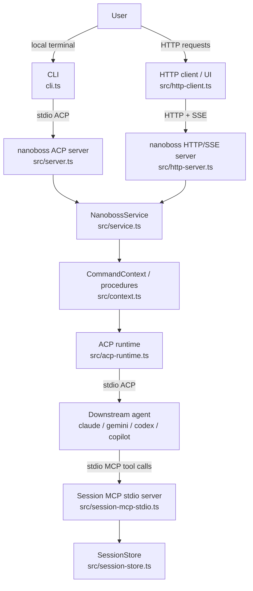
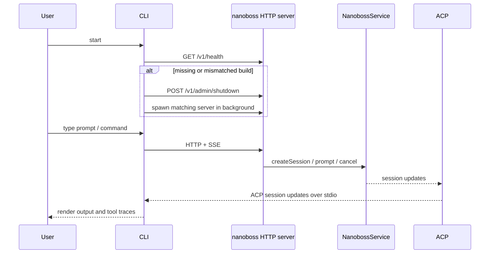
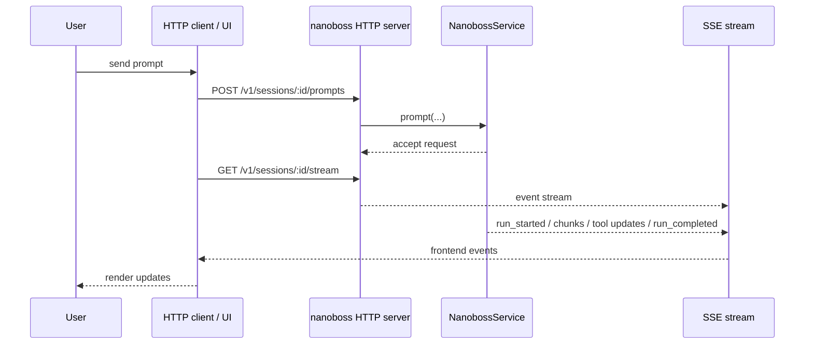
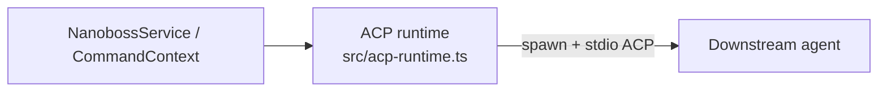
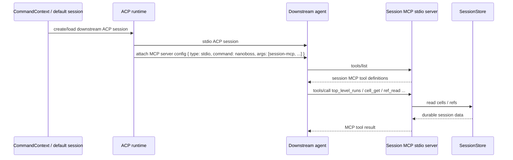

# nanoboss architecture

This document describes the transport-level architecture of nanoboss.

The key distinction is:

- **frontend transport**: how a user or UI talks to nanoboss
- **agent transport**: how nanoboss talks to downstream agents
- **session inspection transport**: how downstream agents inspect nanoboss session state

## Transport inventory

### 1. Frontend HTTP/SSE
Used when nanoboss runs as an HTTP server.

- request/response API:
  - `POST /v1/sessions`
  - `POST /v1/sessions/:id/prompts`
  - `POST /v1/sessions/:id/cancel`
  - `GET /v1/sessions/:id`
- streaming API:
  - `GET /v1/sessions/:id/stream` via **SSE**

Relevant files:
- `src/http-server.ts`
- `src/http-client.ts`
- `src/frontend-events.ts`
- `src/service.ts`

### 2. ACP over stdio
Used in two places:

- the local CLI launches nanoboss's internal ACP server over stdio
- nanoboss launches downstream agents over stdio ACP

Relevant files:
- nanoboss ACP server:
  - `src/server.ts`
  - `cli.ts`
- downstream ACP client/runtime:
  - `src/acp-runtime.ts`
  - `src/call-agent.ts`
  - `src/default-session.ts`

### 3. Session MCP over stdio
Used so downstream agents can inspect durable nanoboss session cells and refs.

This is **not** ACP. It is an MCP server attached to downstream ACP sessions over stdio.

Relevant files:
- `src/session-mcp.ts`
- `src/session-mcp-stdio.ts`
- `src/mcp-attachment.ts`
- `src/session-store.ts`

---

## High-level picture

---

## Default CLI path

When you run `nanoboss cli` without `--server-url`, the CLI connects to nanoboss over **HTTP/SSE** at `http://localhost:6502`.
For loopback URLs, the CLI first checks the server health/build id and will start
or restart the server automatically if it is missing or running a different
nanoboss commit.

Relevant files:
- `cli.ts`
- `src/server.ts`
- `src/service.ts`

---

## HTTP/SSE frontend path

When you run `nanoboss http`, frontend clients talk to nanoboss over HTTP, and live updates come back over SSE.

Relevant files:
- `src/http-server.ts`
- `src/http-client.ts`
- `src/frontend-events.ts`
- `src/service.ts`

---

## Downstream agent path

Nanoboss talks to downstream agents using **ACP over stdio**.

This path is used by:
- one-shot `callAgent(...)`
- persistent `/default` conversation sessions

Relevant files:
- `src/acp-runtime.ts`
- `src/call-agent.ts`
- `src/default-session.ts`
- `src/context.ts`

---

## Session MCP attachment path

When nanoboss launches a downstream ACP session, it also attaches a **stdio MCP server** so the downstream agent can inspect stored session state.

This is the current shape:

- downstream agent connection to nanoboss: **ACP over stdio**
- downstream agent connection to session tools: **MCP over stdio**

Relevant files:
- `src/mcp-attachment.ts`
- `src/session-mcp-stdio.ts`
- `src/session-mcp.ts`
- `src/session-store.ts`

---

## What is *not* split today

### ACP is not HTTP + stdio in this repo
ACP is currently **stdio-only** in nanoboss.

- nanoboss ACP server: stdio only
- downstream agent ACP runtime: stdio only

There is no parallel HTTP ACP implementation in nanoboss.

### Session MCP is not stdio + HTTP anymore
Session MCP is currently **stdio-only**.

The unused HTTP session MCP transport was removed during the simplification pass.

---

## Transport matrix

| Layer | Protocol | Transport | Direction |
|---|---|---|---|
| Local CLI ↔ nanoboss | ACP | stdio | bidirectional |
| HTTP client ↔ nanoboss | nanoboss frontend API | HTTP | request/response |
| HTTP client ↔ nanoboss | frontend events | SSE | server → client |
| nanoboss ↔ downstream agent | ACP | stdio | bidirectional |
| downstream agent ↔ session tools | MCP | stdio | bidirectional |

---

## Mental model

A useful way to think about the stack is:

1. **Users talk to nanoboss** either through:
   - local CLI over **ACP/stdin-stdout**, or
   - remote HTTP API over **HTTP + SSE**
2. **Nanoboss talks to downstream agents** over **ACP/stdin-stdout**
3. **Downstream agents inspect nanoboss session state** through **MCP over stdio**

So the current architecture is intentionally mixed:

- **ACP for agent orchestration**
- **HTTP/SSE for frontend integration**
- **stdio MCP for session-state inspection**
