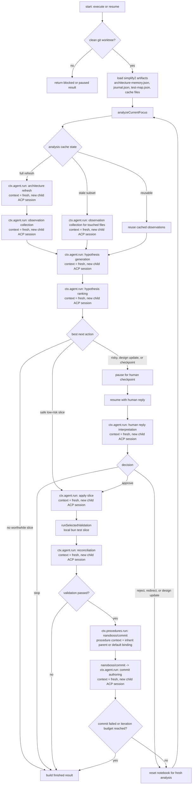

# simplify2(7)

## NAME

`/simplify2` - bounded conceptual simplification loop for the current repository

## SYNOPSIS

```text
/simplify2 [focus]
```

## DESCRIPTION

`/simplify2` is a built-in nanoboss procedure that looks for conceptual
simplifications in the current repository, applies small coherent slices when
the design is clear, and pauses for human input when the boundary is ambiguous.

Focus is the durable unit of simplify2 state. A named focus reopens its own
research cache, architecture memory, journal, and continuation state. Bare
`/simplify2` opens a focus picker so you can continue, archive, or replace
saved focuses without remembering old session ids.

Unlike `/simplify`, which asks the agent for one next opportunity at a time,
`/simplify2` runs a structured loop with durable state:

1. require a clean git worktree before starting
2. load inspectable simplify artifacts
3. refresh architecture memory for the current focus
4. collect typed observations
5. generate and rank hypotheses
6. choose one of:
   - pause for a checkpoint
   - apply one low-risk slice
   - finish because no worthwhile next slice stands out
7. after an apply, run a narrow validation slice, reconcile memory, and
   auto-commit the finished slice through `nanoboss/commit`

By default, simplify2 lands at most one slice per invocation. The older
multi-iteration foreground loop is now opt-in.

You can override that budget with phrases like:

```text
/simplify2 max 5 iterations focus on session metadata ownership
```

or:

```text
/simplify2 max iterations 6 focus on continuation persistence
```

If the worktree becomes dirty after a paused checkpoint, `/simplify2` stays
paused and refuses to continue the apply path until the tree is clean again.

If you omit the focus:

- no saved focuses: simplify2 asks for `new <focus>`
- one saved focus: simplify2 reopens it directly
- multiple saved focuses: simplify2 opens a focus picker

## AUTO-COMMIT

Each successfully applied simplify2 slice is committed automatically through the
existing repo-local `nanoboss/commit` workflow. That means simplify2 keeps its
own narrow validation slice, then reuses the repo's canonical pre-commit checks
before creating the actual git commit.

If the simplify2 validation fails, no commit is attempted.

If the commit workflow fails, the simplify2 run stops and reports that failure
instead of continuing to another iteration.

## HUMAN CHECKPOINTS

`/simplify2` pauses when the top-ranked next slice is not obviously safe to apply.
Common pause cases:

- ownership or boundary changes
- design updates
- any non-low-risk hypothesis

Paused checkpoint output is rendered by the host from typed simplify2 state. It
shows the current iteration as `Iteration N/M`, the selected proposal, the
competing hypotheses, why the chosen hypothesis ranked highest, and the
available actions.

In the TUI, paused simplify2 checkpoints also expose a focused continuation card:

- `1` continue
- `2` stop
- `3` focus on tests
- `4` something else

The CLI and TUI also support a local `--simplify2-auto-approve` mode, plus a
`ctrl+g` toggle, that auto-submits `approve it` for simplify2 checkpoints only.

If you leave a paused simplify2 run and come back later, reopening the same
focus surfaces the checkpoint again. You can still reopen the saved session
with:

```text
nanoboss resume
```

or `nanoboss resume <session-id>`.

After the session is resumed, the existing paused checkpoint still waits for a
plain-text continuation reply such as `approve it`, `stop`, or a redirect. Auto-
approve is not retroactive for an already-paused checkpoint that was restored on
resume; it only affects later simplify2 pauses or an explicit in-session toggle.

## WHAT IT LOOKS FOR

`/simplify2` is generic across repositories, but it is not a single generic
"clean up the repo" prompt. It explicitly asks the downstream agent to look for:

- accidental concepts
- fake or overly split boundaries
- duplicated representations
- exceptions that should be removed
- test duplication and test smells
- architecture drift or design evolution signals

It separates those concerns into typed phases rather than asking for one freeform
proposal up front.

When paused, plain-text user replies are interpreted into one of these decisions:

- approve the current hypothesis
- reject the current hypothesis
- redirect the search
- revise the intended design
- stop

## FILESYSTEM ARTIFACTS

`/simplify2` keeps inspectable repo-local artifacts under:

```text
.nanoboss/simplify2/
  index.json
  focuses/
    <focus-id>/
      focus.json
      state.json
      architecture-memory.json
      journal.json
      test-map.json
      observations.json
      analysis-cache.json
```

These files are intentionally local and are best-effort added to the repo-local
git exclude list so they do not show up as normal tracked changes.

## VALIDATION

After applying a slice, `/simplify2` selects a minimal trusted test slice based
on the selected hypothesis and inferred test map, then runs:

```text
bun test <selected test files>
```

If no trusted slice matches the scope, validation is recorded as skipped.

If validation fails, the current run stops and reports that failure instead of
continuing deeper into the loop.

## PROMPT SHAPE

The procedure uses several structured typed prompts rather than one monolithic
instruction:

- architecture refresh
- observation collection
- hypothesis generation
- hypothesis ranking
- human-reply interpretation
- apply-one-slice
- reconciliation after validation

That makes the command more inspectable and easier to steer than `/simplify`.

## EXECUTION FLOW



## AGENT SESSION CONTEXT

All direct `ctx.agent.run(...)` invocations inside `procedures/simplify2.ts` omit
`session`, so they use the default agent session mode: `"fresh"`. In nanoboss,
that means each call runs in a new isolated downstream ACP session rather than
continuing the parent/default conversation.

This behavior comes from the core API:

- `CommandCallAgentOptions.session` defaults to `"fresh"` ([src/core/types.ts](/Users/jflam/agentboss/workspaces/nanoboss/src/core/types.ts))
- `AgentInvocationApiImpl.run()` resolves `const sessionMode = options?.session ?? "fresh"` ([src/core/context-agent.ts](/Users/jflam/agentboss/workspaces/nanoboss/src/core/context-agent.ts))

So `/simplify2` is a multi-step loop in *procedure state*, but not a single
continuous downstream-agent conversation.

### Direct `ctx.agent.run()` sites in `/simplify2`

| Phase | Source | Output type | Session context |
| --- | --- | --- | --- |
| Architecture refresh | `refreshArchitectureMemory()` at `procedures/simplify2.ts:722` | `ArchitectureRefreshProposalType` | `fresh` -> new child ACP session |
| Observation collection | `collectObservations()` at `procedures/simplify2.ts:767` | `ObservationBatchType` | `fresh` -> new child ACP session |
| Hypothesis generation | `generateAndRankHypotheses()` at `procedures/simplify2.ts:786` | `HypothesisBatchType` | `fresh` -> new child ACP session |
| Hypothesis ranking | `generateAndRankHypotheses()` at `procedures/simplify2.ts:792` | `HypothesisRankingBatchType` | `fresh` -> new child ACP session |
| Apply slice | `applySimplificationSlice()` at `procedures/simplify2.ts:895` | `SimplifyApplyResultType` | `fresh` -> new child ACP session |
| Reconciliation | `validateAndReconcile()` at `procedures/simplify2.ts:940` | `ReconciliationResultType` | `fresh` -> new child ACP session |
| Human-reply interpretation | `interpretHumanReply()` at `procedures/simplify2.ts:1031` | `SimplifyHumanDecisionType` | `fresh` -> new child ACP session |

### Nested commit path

The commit step is slightly different:

1. `/simplify2` calls `ctx.procedures.run("nanoboss/commit", ...)` at
   `procedures/simplify2.ts:964`
2. `ctx.procedures.run()` defaults to `session: "inherit"`, so the child procedure
   inherits the caller's default-conversation binding
3. inside `nanoboss/commit`, the actual commit-authoring agent call is still
   `ctx.agent.run(..., { stream: false })` with no explicit `session`, so that
   nested call is also `fresh` -> a new child ACP session

That means the procedure context is inherited, but the commit authoring agent
call itself is still isolated.

## EXAMPLES

General repo review:

```text
/simplify2
```

Focus on one subsystem:

```text
/simplify2 focus on session metadata ownership and paused continuation handling
```

Use a larger iteration budget:

```text
/simplify2 max 5 iterations focus on session metadata ownership and paused continuation handling
```

Bias toward a smaller first slice:

```text
/simplify2 focus on continuation persistence; prefer a test or representation simplification before any boundary move
```

## OUTPUT

A run may:

- finish immediately if no worthwhile hypothesis stands out
- pause on a checkpoint question
- auto-apply a low-risk slice and continue into another analysis cycle
- stop after reaching the iteration budget

Finished output includes the latest applied slice, validation result, and counts
for applied and rejected hypotheses. When a slice was committed successfully,
the latest output also includes the commit status line for that slice.

## SEE ALSO

- [procedures/simplify2.ts](/Users/jflam/agentboss/workspaces/nanoboss/procedures/simplify2.ts)
- [procedures/simplify.ts](/Users/jflam/agentboss/workspaces/nanoboss/procedures/simplify.ts)
- [plans/2026-04-08-simplify-v2-procedure-pseudocode.md](/Users/jflam/agentboss/workspaces/nanoboss/plans/2026-04-08-simplify-v2-procedure-pseudocode.md)
